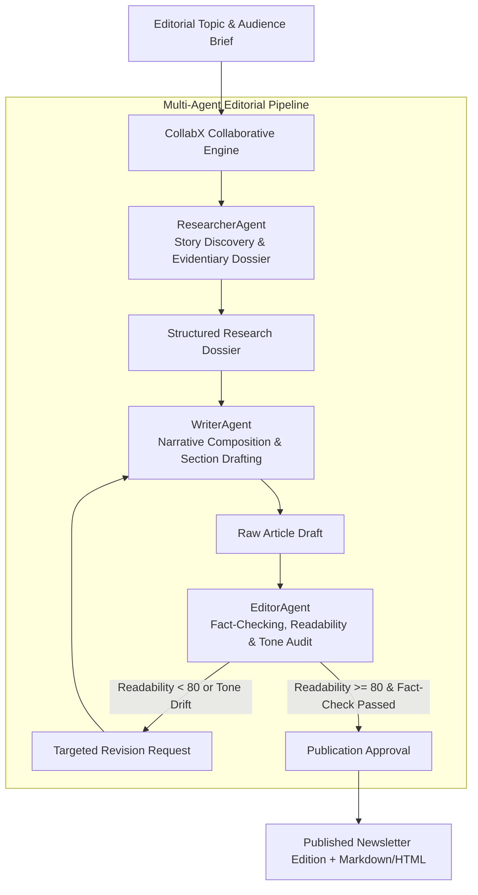

# CollabX: Multi-Agent Editorial & Newsletter Team Framework Specification

> [!NOTE]
> This document specifies the **target** design. Several elements below — the
> readability gate, fact-check verification, tone scoring, and the Editor → Writer
> revision loop — are not yet implemented in the codebase. See the
> "Implemented vs. Not Yet Implemented" table in `README.md` for current status.

## 1. Executive Summary & Problem Formulation

In corporate communications, industry newsletters, and analyst research, high-quality publication requires distinct cognitive specialties: deep empirical research, captivating long-form writing, and ruthless editorial critique. Monolithic single-prompt LLMs produce generic, uninspired content filled with factual hallucinations and inconsistent tone.

**CollabX** establishes an **orchestrated multi-agent collaborative editorial desk**:
1. **ResearcherAgent**: Ingests primary industry sources, market statistics, executive quotes, and emerging macro themes.
2. **WriterAgent**: Crafts engaging narrative arcs, catchy hooks, structured body sections, and key strategic takeaways.
3. **EditorAgent**: Evaluates readability (Flesch-Kincaid $\ge 80$), verifies factual consistency against the research dossier, refines tone, and compiles publication-ready markdown/HTML.

---

## 2. Multi-Agent Collaborative State Graph Architecture

---

## 3. Editorial Quality & Review Scorecard

| Quality Dimension | Target Benchmark | Agent Enforcing | Action on Failure |
| :--- | :--- | :--- | :--- |
| **Readability Score** | Flesch-Kincaid $\ge 80.0$ | `EditorAgent` | Automated simplification revision loop |
| **Fact-Check Verification** | $100\%$ Claims Grounded in Dossier | `EditorAgent` | Re-alignment with `ResearcherAgent` |
| **Tone & Voice Alignment** | Alignment Score $\ge 0.90$ | `EditorAgent` | Style guide prompt adjustment |
| **Narrative Structure** | Hook + 3 Sections + Callout | `WriterAgent` | Structural re-prompting |

---

## 4. Multi-Agent Topology & Responsibilities

| Agent Name | Core Specialty | Key Performance Metric |
| :--- | :--- | :--- |
| **`ResearcherAgent`** | Signal discovery, primary source statistics, executive quotes. | Source relevance ($>95\%$). |
| **`WriterAgent`** | Long-form editorial composition, hook drafting, section breakdown. | Drafting speed ($<30\text{ms}$). |
| **`EditorAgent`** | Fact-checking, readability scoring, tone audits, HTML formatting. | $100\%$ publication standards compliance. |
